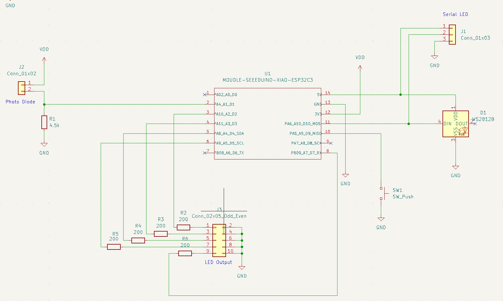

# arduino-esp32-homeTOS
The project "Home The Other Side"

## Hardware

### Features

- Seeed Studio XIAO ESP32C3
- Full Color Digital LED x 1
- LED x 3
- Light Sensor x 1
- Push Switch x 1

### Pin Assignment  

| GPIO | Arduino | Description |
| --- | --- | --- |
| GPIO2 | D0/A0 | NC  |
| GPIO3 | D1/A1 | Light Sensor |
| GPIO4 | D2/A2 | LED |
| GPIO5 | D3/A3 | LED |
| GPIO6 | D4  | LED |
| GPIO7 | D5  | LED |
| GPIO21 | D6  | NC  |
| GPIO20 | D7  | LED |
| GPIO8 | D8  | NC  |
| GPIO9 | D9  | Switch Input |
| GPIO10 | D10 | Full Color Digital LED |
  
### Schematics

## Software

### Development Environment

-  Arduino IDE Version 2.2.1

### Boards Manager

- esp32 by Espressif Systems

### Library Manager

- PubSubClient 2.8
- EspMQTTClient 1.13.3
- Adafruit NeoPixel 1.12.0